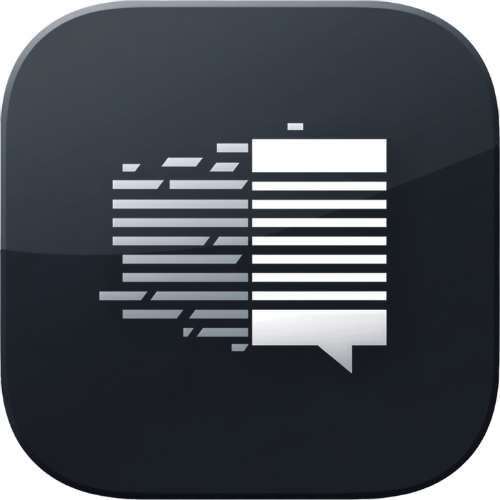

<div align="center">



# AI Chat RTL Fixer

**Fixes right-to-left (RTL) text rendering inside AI desktop chat apps — chat surface only, code and commands stay LTR.**

[English](README.md) - [فارسی](README.fa.md)

[](#system-requirements)
[](https://github.com/miladateight/AI.Chat.RTL.Fixer/releases/tag/v0.1.0)
[](LICENSE)

</div>

---

AI Chat RTL Fixer is a free and open-source Windows tray tool that improves RTL text rendering inside AI desktop chat applications. It is built for Persian, Arabic, Hebrew, Urdu and other RTL-language users who use graphical Windows AI chat apps (Electron / WebView2) and want chat messages to read right-to-left — while code blocks, file paths, URLs, commands and English text stay left-to-right and copy-safe.

> **Scope:** the chat surface only. The sidebar, title bar, menus, settings, file tree, code editor and terminal panels are never modified. Everything is **runtime-only** — closing or disabling the tool removes all changes, and restarting the target app normally always returns it to a clean state.

> ⚠️ **v0.1.0 is a pre-release / framework build.** No app profile is marked *Stable* yet. Detecting an app is **not** the same as a verified fix — see [Supported apps](#supported-apps).

## Download

- Installer: [AIChatRTLFixerSetup-0.1.0.exe](https://github.com/miladateight/AI.Chat.RTL.Fixer/releases/download/v0.1.0/AIChatRTLFixerSetup-0.1.0.exe)
- SHA256: [AIChatRTLFixerSetup-0.1.0.exe.sha256](https://github.com/miladateight/AI.Chat.RTL.Fixer/releases/download/v0.1.0/AIChatRTLFixerSetup-0.1.0.exe.sha256)
- All releases: [GitHub Releases](https://github.com/miladateight/AI.Chat.RTL.Fixer/releases)

Free and open-source. No account, no license key, no network access required.

## Highlights

- Lightweight **system-tray** app — no heavy window, right-click menu, double-click for Settings.
- Fixes **RTL rendering** for Persian, Arabic, Hebrew and Urdu chat messages.
- Keeps **code blocks, paths, commands, URLs and English text LTR** and copy-safe.
- Bundled **Vazirmatn** font applied to the chat surface only.
- **Chat surface only** — sidebar, menus, editor and terminal are untouched.
- **Runtime-only**: disable or quit and every change is removed.
- **Privacy-first**: no telemetry, no analytics, no external network calls.
- Optional, per-app **"Start with Windows"** controlled from the app's own Settings.
- Ships as a **Windows installer** plus two **portable** builds.

## How it works

For Electron-based apps, AI Chat RTL Fixer uses the **Chrome DevTools Protocol (CDP)** over **local loopback (`127.0.0.1`) only**. When a supported app is detected running without a debug port, the tray offers a one-click, **user-consented** *"Relaunch with RTL Fix"* that restarts the app with a random free debug port bound to `127.0.0.1`. It then injects scoped CSS, the bundled Vazirmatn font and a runtime script that classifies each chat block and applies the correct text direction.

## Supported apps

| App | UI technology | Status | Notes |
|---|---|---|---|
| Claude Desktop | Electron | Planned | Selectors are placeholders pending verification on a real install. |
| ChatGPT Desktop | Electron | Planned | Selectors are placeholders pending verification on a real install. |
| Codex Desktop | Unknown | Unsupported | Not detected/tested yet. |
| ZCode | Unknown | Unsupported | Not detected/tested yet. |
| Others (LM Studio, AnythingLLM, ...) | Unknown | Unsupported | UI tech must be confirmed before a profile is written. |

**Status meanings:** *Stable* = verified against a real installed app version · *Experimental* = works but may break after app updates · *Planned* = detected/known, no safe injection yet · *Unsupported* = no safe method found yet.

> **No profile is marked Stable in v0.1.0.** Detection does not mean support.

## Privacy & security

- No telemetry, no analytics, no cloud service, no account, no API keys.
- **No external network calls** — only local loopback (`127.0.0.1`) to debug-enabled target apps.
- A **random free port** is chosen per session; the debug endpoint is bound to `127.0.0.1` only and the loopback URL is verified before connecting.
- Chat history and clipboard content are never stored. Logs contain **safe metadata only — no chat text**.
- Settings and logs live under `%AppData%\AIChatRTLFixer\`.

## Install & run

**Installer (recommended):** run `AIChatRTLFixerSetup-0.1.0.exe`. It installs to `C:\Program Files\AI Chat RTL Fixer`, adds a Start Menu shortcut (desktop shortcut optional), and a standard uninstaller. It does **not** force "Start with Windows". Uninstalling removes the installed files and — only if you confirm — your settings/logs.

**Portable (no install):** run `AI.ChatRTLFixer.Tray.exe` from either build:

- **Self-contained (win-x64)** — no prerequisites (bundles .NET 8).
- **Framework-dependent** — small; needs the [.NET 8 Desktop Runtime](https://dotnet.microsoft.com/download/dotnet/8.0).

The tray icon appears in the notification area. Double-click it to open Settings; right-click for the menu.

## System requirements

- Windows 10 or Windows 11, 64-bit.
- For the framework-dependent build only: .NET 8 Desktop Runtime.

## Build & package from source

Requirements: **.NET 8 SDK**, and **Inno Setup 6** for the installer (a compiler can be placed in `.tools\InnoSetup\`, or install it from <https://jrsoftware.org/isdl.php>).

```powershell
# build + test
dotnet build AI.ChatRTLFixer.sln -c Release
dotnet test  AI.ChatRTLFixer.sln -c Release

# one command: build, test, branding, both portable builds, installer
powershell -ExecutionPolicy Bypass -File scripts\build-all.ps1
```

Outputs are written under `dist\`:

```text
dist\portable-framework-dependent\AI.ChatRTLFixer.Tray.exe
dist\portable-self-contained-win-x64\AI.ChatRTLFixer.Tray.exe
dist\installer\AIChatRTLFixerSetup-0.1.0.exe
```

See [docs/RELEASE.md](docs/RELEASE.md) for details, and [docs/README.md](docs/README.md) for full documentation.

## Validation status (v0.1.0)

- `dotnet build` (Release): pass — 0 warnings, 0 errors
- `dotnet test`: pass — 66/66 (Core 10, Rules 40, Integration 16 incl. Playwright)
- Publish framework-dependent: pass
- Publish self-contained win-x64: pass
- Inno Setup installer compile: pass
- SHA256 generation: pass

## Font license

Bundles **Vazirmatn** (Regular) under the **SIL Open Font License 1.1**. The project code is **MIT** licensed. The font is applied only to the chat surface, never to the rest of the app UI.

## Contact

- Telegram: [@MiladAteight](https://t.me/MiladAteight)
- Email: ateight088@gmail.com

## License

Copyright (c) 2026 Milad AT8. AI Chat RTL Fixer is released under the **MIT License** — see [LICENSE](LICENSE).
